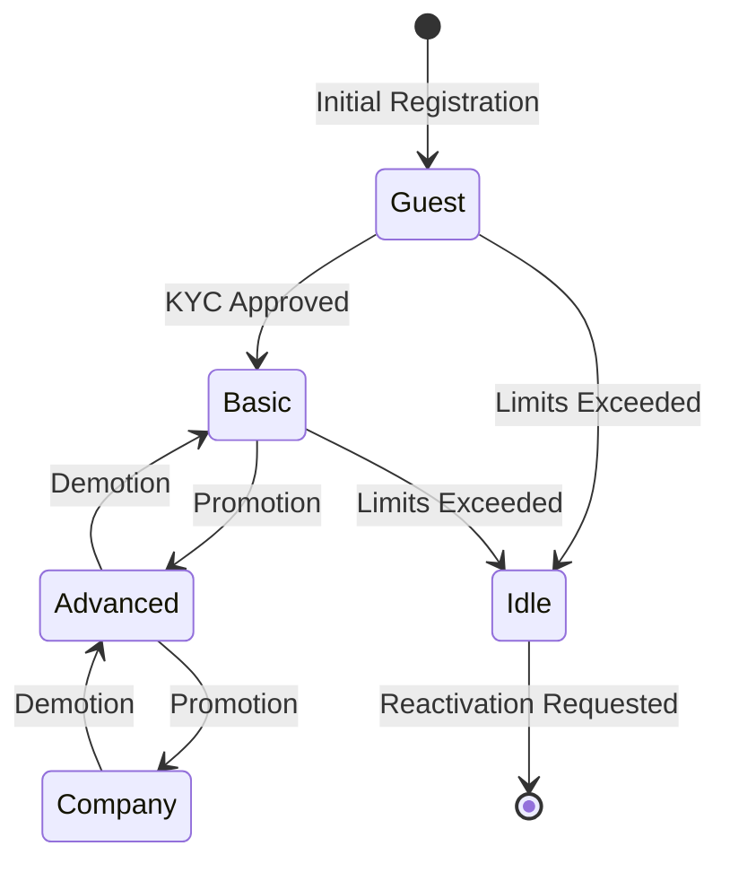
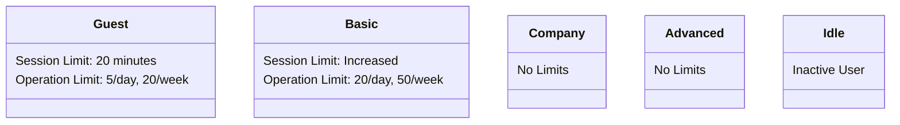

# (Task 1) User State and Account Management

## State Transitions

This diagram shows the different stages a user can go through in the system, from initial registration to becoming inactive and potentially being reactivated. The arrows represent how users move between these stages based on actions or events like completing verification, getting promoted or demoted, or exceeding usage limits.

**Diagram 1: State Transitions**

## State Descriptions

This diagram outlines the different types of user accounts in the system and their associated limitations. 
Each user type has specific restrictions on usage, such as time limits and allowed operations.

**Diagram 2: State Descriptions**

